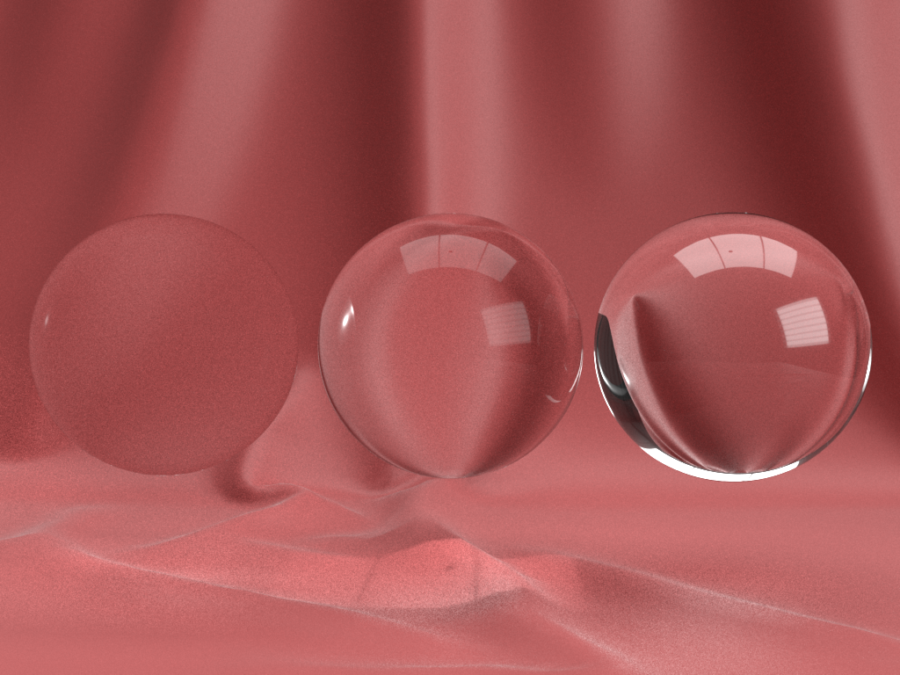

# KHR\_materials\_volume

## Contributors

* Mike Bond, Adobe, [@miibond](https://github.com/MiiBond)

## Status

In Progress

## Dependencies

Written against the glTF 2.0 spec.

## Overview

Requires the use of KHR_materials_transmission
This extension enables volumetric effects and includes parameters to define refraction, absorption and scattering of light within a volume. The thickness of the volume itself can be described either by the geometry (must be a closed surface) or by providing explicit thickness information via parameters in this extension.

## Extending Materials

The interior of a transparent material can be given volumetric information by adding the `KHR_materials_volume` extension. The material must already use the `KHR_materials_transmission` extension so that the interior of the material is actually visible. Otherwise, the extension would have no visible effect on the rendered image. When present, this extension indicates that a material should be rendered as a transparent volume and be blended as defined in the following spec. Alpha coverage and `doubleSided` properties still apply to transparent materials. As per the glTF spec, Alpha Coverage allows the background to show through a material (i.e. not the interior volume).

The behaviour of overlapping volumes is undefined. It is recommended to avoid this case in authoring your assets.

```json
materials: [
  {
    "extensions": {
       "KHR_materials_volume": {
         "absorptionColor": [ 0.8, 0.1, 0.1 ],
         "absorptionDistance": 0.5,
         "interiorIor": 1.0,
         "useThicknessFromTransmission": true,
         "useThicknessFromVolume": false,
         "maxThickness": 0.2,
         "minThickness": 0.0
       }
    }
  }
]
```

## Properties 

This extension introduces several parameters that define the absorption and scattering properties of the volume. In addition, it also allows for several ways to define how the thickness of the volume is determined. 

|   |Type|Description|Required|
|---|----|-----------|--------|
|**absorptionColor** | `number[3]` | The colour of light remaining when a pure white light travels `absorptionDistance` metres through the volume.| No, default:`[1.0, 1.0, 1.0]`|
|**absorptionDistance** | `number` | The distance through the volume where enough photons of the right wavelength will be absorbed to turn white light into `absorptionColor`. | No, default: `1.0` |
|**interiorIor** | `number` | The index of refraction of the interior of the material. | No. Default is `1.33` which is IOR for liquid water. |
|**subsurfaceColor** | `number[3]` | The colour of light remaining when a pure white light goes through multiple scattering events (assuming no absorption).| No, default:`[1.0, 1.0, 1.0]`|
|**useThicknessFromTexture** | `boolean` | If true, the varying thickness of the volume will be read from the G channel of the transmission texture. | No, default: `false` |
|**useThicknessFromVolume** | `boolean` | If true, the thickness of the volume will be defined by the actual enclosed volume of the geometry. If not supported by the renderer, thickness will taken as `minThickness` | No, default: `false` |
|**minThickness** | `boolean` | When using a thickness texture, a texture value of 0.0 is interpreted to be `minThickness`. When a constant thickness is used, the thickness will be `minThickness` | No, default: `0.0` |
|**maxThickness** | `boolean` | When using a thickness texture, a texture value of 1.0 is interpreted to be `maxThickness`. Values between 0.0 and 1.0 are linearly scaled between `minThickness` and `maxThickness` | No, default: `1.0` |

### absorptionColor and absorptionDistance

Light can be absorbed as it travels through a medium and the amount of absorption can vary by wavelength. The Absorption Color defines the remaining colour after white light travels some distance through the medium. This distance is defined by the `adsorptionDistance` parameter.

For a given ray of light travelling a distance through a volume, absorption can be simulated by multiplying the light by the transmittance for that distance. Transmittance is the colour of light that survives the trip through the medium over that distance. **Beer's Law** can be used to calculate the transmittance for a given distance and material density.
transmittance = *e*<sup>(*-t* * *d*)</sup>

where **t** is the distance through the medium and **d** is the density of the particles that are absorbing the light.

We can compute the density at each wavelength using the `absorptionDistance` and `absorptionColor`. Since we know that, at `absorptionDistance`, the transmittance is given by `absorptionColor`, we can calculate the density, **d**, to use for each wavelength, red, green and blue.
**d**<sub>*red*</sub> = -ln(`absorptionColor.r`) / `absorptionDistance`;

Since **d** is constant for a given material, you can compute this and pass it to the shader to be used with **Beer's Law**.


### subsurfaceColor

Density (i.e. mean free path) at each wavelength can be computed as above and used for SSS calculation.

*Math goes here!!!*
Equation 1 from https://developer.nvidia.com/gpugems/GPUGems3/gpugems3_ch13.html

final transmitted light = transmittance after absorption + scattered light

Scattered light **L**<sub>scatter</sub> = (1 - *e*<sup>(*-t* * *d*)</sup>) / t and then multiplied by the source illumination and a term composed of Rayleigh and Mie scattering properties (which depend on the angle between the ray and the illumination source).

Need help defining this.

### interiorIor

This defines the index of refraction of the volume as different from that of the material's surface. i.e. the reflectivity (F0) of the material's surface is not affected by this value. This value affects the amount that a ray of light bends when entering and leaving the volume. The amount of bending can be found using **Snell's Law**. Since this extension doesn’t deal with dispersion, the index of refraction is assumed to be the same for all wavelengths.

## Thickness Properies
The thickness of a closed volume is typically quite difficult to compute in a rasterizer. Since glTF is primarily used with real-time rasterizers, this extension allows for the thickness of the volume to be explicitly defined, either via a greyscale texture value or as a constant. However, we also allow the thickness along a ray to be derived from the actual geometry for path-traced renderers as well as more sophisticated raster techniques.

### useThicknessFromTexture

If true, the varying thickness of the volume will be read from the G channel of the transmission texture.

### useThicknessFromVolume

If true, the thickness of the volume will be defined by the actual enclosed volume of the geometry. If not supported by the renderer, thickness will taken as `minThickness`.

### minThickness
When using a thickness texture, a texture value of 0.0 is interpreted to be `minThickness`. When neither `useThicknessFromTexture` or `useThicknessFromVolume` is true, `minThickness` is used as a constant thickness.

### maxThickness
When using a thickness texture, a texture value of 1.0 is interpreted to be `maxThickness`. Values between 0.0 and 1.0 are linearly scaled between `minThickness` and `maxThickness`. If a thickness texture is not used, this value is ignored.


## Thickness and Asset Scale

This specification uses units of 1 metre for `minThickness`, `maxThickness` and `absorptionDistance`. The asset should be authored so that these values are correct when the model is unscaled (i.e. 1.0 scale multiplier).
It is the discretion of the loading application whether to scale these values when the model is scaled to either achieve consistent rendering or to render as if the volume is changing with scale. Using a thickness texture will naturally result in consistent rendering at any scale and will require `minThickness` and `maxThickness` to vary in order to change this. When `useThicknessFromVolume` is set, the opposite will be true. The `absorptionDistance` will need to be scaled with model size to maintain consistent results.

## Refraction

The index of refraction of the interior volume directly affects the amount that light is refracted (bent) when travelling from material #1 to material #2. This is very simply expressed by **Snell's Law**:
n<sub>1</sub>sin(&#1012;<sub>1</sub>) = n<sub>2</sub>sin(&#1012;<sub>2</sub>)
where n<sub>1</sub> is the IOR for material #1 and &#1012;<sub>1</sub> is the angle of incidence of the light ray. n<sub>2</sub> is the IOR for material #2 and &#1012;<sub>2</sub> is the angle of refraction.

<figure>
  
<figcaption><em>From left to right: Indices of refraction of 1.03, 1.33 (water) and 1.8 (glass). Rendered in Adobe Dimension.</em></figcaption>
</figure>

However, once again, rasterizers present a challenge in rendering this in a physically realistic way. For that reason, we will describe some recommended ways of faking general scene refractions. Note that more accurate representations of refractions may be possible in particular scenarios (e.g. if the entire scene outside of your central object can be represented as a light probe or environment map, you can sample)